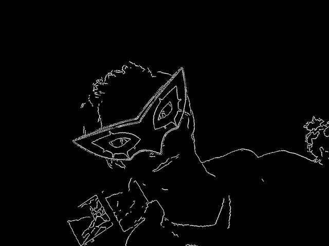
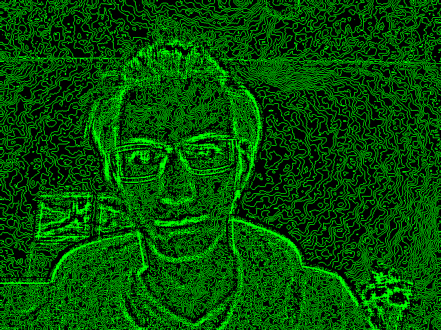

# live-cam-video-filter

Apply basic filters to video in real time.

# features and GIFs

<b>Edge Detection</b>: Variations of Canny, Sobel, and Laplacian </b>(click to see example)</b> 

 

<b>Face Detection</b>: Uses face and eye detection to apply wearable mask filters that adjust size and position to cover the target. 

 

<b>Color Filters</b>: Hue Saturation Value (HSV), L\*a\*b\*, Gray Scale, Red, Green, and Blue 

 

<b>Blur</b>: Averages neighboring pixels to blur the image. Kernel size is adjustable. 

 

<b>Foreground Scenery</b>: Add opaque or transparent foreground images to the video.

 

<b>Geometric Transformations</b>: Translate the video along the x or y axis, rotate the video about it's center or increase / decrease the scale of the video.

 

# controls

<b>ctrl + c</b>: copy current frame to clipboard 
<b>ctrl + s</b>: save current frame 
<b>q</b>: quit 
<b>f</b>: on / off face detection 
<b>h</b>: Cycle the thickness of the face detection ring (none, 1, 3, 5, solid) 
<b>g</b>: on / off for foreground opacity 
<b>r</b>: resets all modifications to initial state 
<b>left / right-arrow</b>: Change between features 
<b>up / down-arrow</b>: Change the current feature's settings 

# stackable filters

The filters are applied sequentially to the video frame such that filteres of different types can be used together.  

For example, an eye mask filter that uses face detection can be used at the same time as an image rotation and a Canny edge detection filter are applied:

 

 

Or a color filter can be applied on top of a Laplacian edge detection filter with moderate image blur:

 

 

# credits

Please read the LICENSE file as well as the Intel licence located in the header of video_editor.py

The latter is included because the haar_cascade face and eye classifiers were obtained here: https://github.com/opencv/opencv/tree/master/data

All images were labeled free for personal use and the original artists are listed in images/artist_credits.txt.